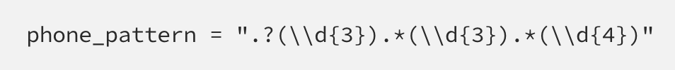

# Regex-Research
## Tidyverse

Tidyverse aims at easing data manipulation with javascript. It can help with formatting specific dates or even phone numbers. It will organize code and make sure everything in the code database is organized. 

## Summary

The regex I will be describing is the Tidyverse regex, it is a package that organizes code and removes problems caused by users inputting "-" or "()" in inputs such as phone numbers, it allows the code to be read properly regardless of those non-number inputs.

## Table of Contents

- [Regex Pattern](#regex-pattern)
- [String Match](#string-match)

## Regex Components

### Regex Pattern
-The ".?" means there are 0 or 1 character to account for in the optional opening parenthesis.

-"(\\\d{3})" means 3 digit characters of the first & second capture group

-".*" means 0 or more characters to account for in the optional closing

-"(\\\d{4})" means 4 digit characters in the third capture group

### String Match

The string match function allows us to retrieve the capture groups using the regex pattern we have defined and put them into individual columns in the database.

## Author

My name is Amer Kulovic, I am a software engineer who loves to research about code!

[GitHub](https://github.com/amerkulovic)
